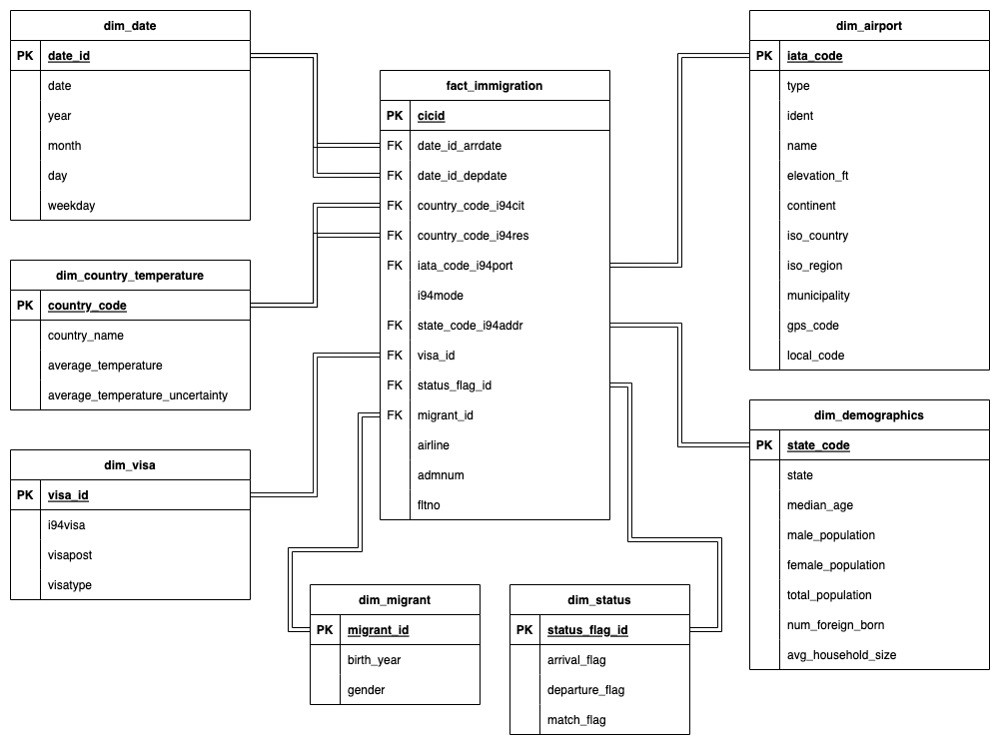

# U.S. Immigration Data Engineering  
In this project, we will conduct a study on Immigration Data in the united states with regards to World Temperature Data, U.S. City Demographic Data, and Airport Code Data. That is to answer questions such as, what is the percentage of people that immigrate to the U.S from countries with cooler weather?, etc..

The goal is to create ETL pipelines that extract each dataset from the source, apply several levels of transformation, then make it ready to be loaded into an analytics database (data warehouse) with a new consolidated data model that serves the analysis and study needs.

## Datasets
Here is an outline about the datasets:
- **I94 Immigration Data:** This data comes from the US National Tourism and Trade Office. [This](https://travel.trade.gov/research/reports/i94/historical/2016.html) is where the data comes from. There's a sample file so you can take a look at the data in csv format before reading it all in.
- **World Temperature Data:** This dataset came from Kaggle. You can read more about it [here](https://www.kaggle.com/berkeleyearth/climate-change-earth-surface-temperature-data).
- **U.S. City Demographic Data:** This data comes from OpenSoft. You can read more about it [here](https://public.opendatasoft.com/explore/dataset/us-cities-demographics/export/).
- **Airport Code Table:** This is a simple table of airport codes and corresponding cities. It comes from [here](https://datahub.io/core/airport-codes#data).

## Project Steps
The project follows the following steps:
* Step 1: Scope the Project and Gather Data
* Step 2: Explore and Assess the Data
* Step 3: Define the Data Model
* Step 4: Run ETL to Model the Data
* Step 5: Complete Project Write Up

## Data Model
Using the mentioned datasets, we have mapped out a conceptual data model concerning immigration data and its different dimensions as follows:

The data model here represents immigration instances with regard to airport data, demographic data, temperature data, and others. The model is designed as a **Star schema** in the data warehouse, where the desired immigration facts and info are in the fact table, and other perspective information and features that include an object in the fact table are dimension tables.

The star schema is suitable for the analytics purposes of immigration study, since it connects relevant information within a proper number of aggregations and links (fewer joins), and decreases the records duplication at an adequate level with respect to schema complexity.

**Fact table:**
- Immigration table

**Dimension tables:**
1. Migrant
1. Status
1. Visa
1. Demographics
1. Airport
1. Country Temperature
1. Date

## Project Structure
The project structure is shown as the following:
- `capstone_project.ipynb`: is where the project steps are implemented.
- `clean_tables.py`: contains functions that clean the project datasets.
- `schema_tables.py`: contains functions that create the proposed data model tables.
- `utils.py`: contains different functions for utilization.
- `I94_SAS_Labels_Descriptions.SAS`: immigration data label mapping.
- `data_dictionary.md`: data dictionary for the proposed data model.
- `conceptual_data_model.png`: diagram of the conceptual data model.
- `data`: folder contains some of the project datasets.
- `README.md`: provides discussion about the project.

